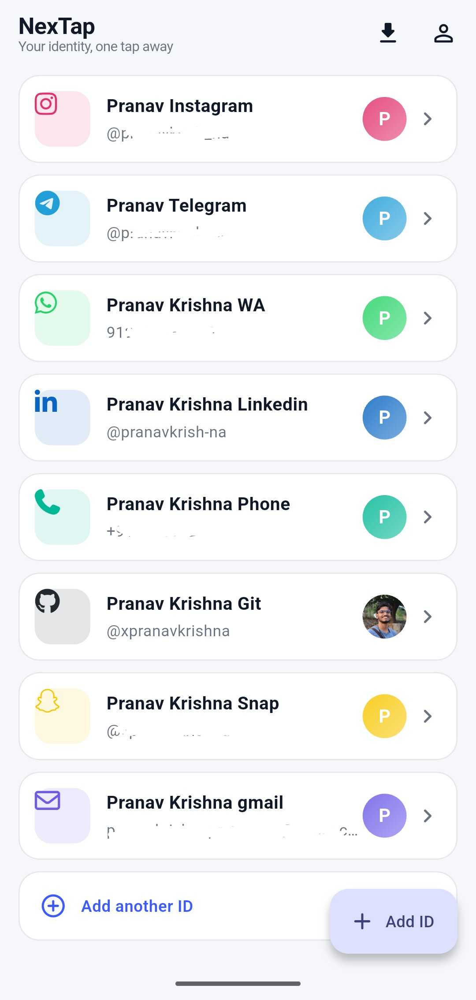
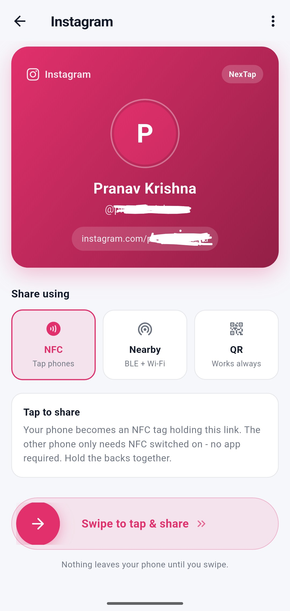
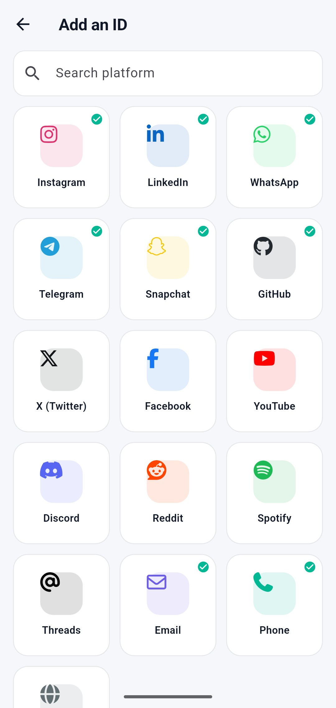
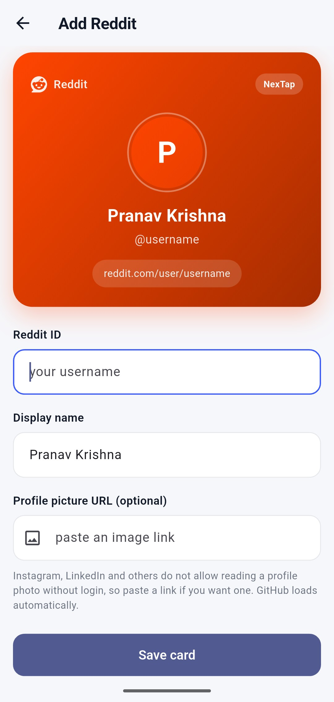

# NexTap

**Your identity, one tap away.**

---

## The story

I saw a guy with an NFC card. He tapped it on my phone and his LinkedIn profile just opened, straight in the LinkedIn app. No typing, no searching his name, nothing. That was it.

I know this isn't a new idea — plenty of NFC business card apps already exist. I just saw it happen in person and got a random thought: "I don't have a card like that, why not just build the app myself." So this is less an original invention and more a random-thought project. Made it for fun, added Bluetooth/Wi-Fi and QR as backups since I don't have a programmable NFC card to test the real thing with.

Thanks to me and vibe coding. 🤙

---

## What it does

Save your social media IDs once — Instagram, LinkedIn, WhatsApp, Telegram, Snapchat, GitHub, and more — then share any of them with someone nearby in three ways:

1. **NFC** — hold the phones back to back. Their phone doesn't even need this app, just NFC switched on. It reads your phone like a tag and opens the link.
2. **Nearby (Bluetooth + Wi-Fi Direct)** — no common Wi-Fi network needed, works fully offline between two phones. Both need NexTap installed for this one.
3. **QR code** — works on literally any phone with a camera.

Add a card, pick how to send it, swipe to confirm, done.

---

## Screenshots

<!-- Drop your screenshots in a folder (e.g. /screenshots) and update the paths below -->

| Home | Share (NFC / Nearby / QR) | Search Platform | Add Card |
|---|---|---|---|
|  |  |  |  |

---

## Setup

```bash
git clone https://github.com/xPranavKrishna/NexTap-Digital-Card.git
cd nextap
flutter pub get
flutter run
```

### Gradle settings to check

Your `android/app/build.gradle.kts` should keep this structure:

```kotlin
android {
    namespace = "com.nextap.nextap"
    compileSdk = flutter.compileSdkVersion
    ndkVersion = flutter.ndkVersion

    compileOptions {
        sourceCompatibility = JavaVersion.VERSION_17
        targetCompatibility = JavaVersion.VERSION_17
    }

    kotlinOptions {
        jvmTarget = JavaVersion.VERSION_17.toString()
    }

    defaultConfig {
        applicationId = "com.nextap.nextap"
        minSdk = flutter.minSdkVersion
        targetSdk = flutter.targetSdkVersion
        versionCode = flutter.versionCode
        versionName = flutter.versionName
    }
}
```

`namespace` and `applicationId` must match the Kotlin package (`com.nextap.nextap`) and its folder path (`android/app/src/main/kotlin/com/nextap/nextap/`), or the NFC service won't bind.

---

## What's in the box

```
lib/
  main.dart                     app entry, loads saved cards before first frame
  theme.dart                    light theme, colors, card shape
  models/social_card.dart       16 platforms + link builders + the card model
  services/
    card_store.dart             save/load cards (shared_preferences)
    nfc_service.dart            NFC status, emulate-a-tag, write tag, read tag
    nearby_service.dart         Bluetooth + Wi-Fi Direct send/receive
  widgets/
    cards.dart                  Avatar, CardTile, ProfileHeroCard
    swipe_to_send.dart          the slide-to-confirm button
  screens/
    home_screen.dart            saved cards list
    add_card_screen.dart        platform grid with brand icons + search
    edit_card_screen.dart       form with a live card preview
    card_detail_screen.dart     hero card + NFC/Nearby/QR picker + swipe to send
    qr_screen.dart              generated QR with mini profile card
    receive_screen.dart         3 tabs: Scan QR / Nearby / NFC read
android/
  MainActivity.kt               MethodChannel bridge to the native NFC code
  NdefHostApduService.kt        makes the phone act like an NFC tag
  apduservice.xml               registers the NFC tag type Android should route here
```

For a full breakdown of every module, why each design choice was made, and the exact tech limits of each sharing method, see **`reference.md`** in this folder.

---

## The honest tech reality

- **NFC "sending"** doesn't exist as an Android API anymore — Android Beam was removed in Android 10. This app fakes it by making your phone impersonate an NFC tag (Host Card Emulation), which is why the other phone needs nothing but stock NFC turned on. Only works phone-to-phone on Android; iPhones can't emulate NFC tags for third-party apps at all, so this app hides that option there and falls back to QR.
- **Bluetooth/Wi-Fi sharing** doesn't need a shared network, but both phones do need NexTap installed — unlike NFC and QR, raw Bluetooth has no "system default app" to hand a link to.
- **QR** always works, with zero setup, on anything with a camera.
- Two real Android phones are required to test NFC or Nearby — neither works on an emulator.

---

## Ideas for next version

- One "share all cards at once" button (the data plumbing for this already exists, just needs a UI button)
- Drag to reorder saved cards
- A history of received contacts
- Dark mode